# 🏗️ Multi-Passenger Flight Booking System - Architecture Diagrams

## 📊 **1. HIGH-LEVEL DESIGN (HLD)**

## 🔄 **2. SEQUENCE DIAGRAM**

```mermaid
sequenceDiagram
    participant User
    participant AI as AI Agent
    participant LA as Logic App
    participant AUTH as OAuth Service
    participant PP as Process_Passengers
    participant CTR as Compose_Terminal_API_Request
    participant TAPI as Terminal API
    participant PSS as PSS System
    participant HAR as Handle_API_Response
    
    %% User Interaction
    User->>AI: "Book flight for John Doe and Jane Doe from DFW to LAX"
    AI->>AI: Parse multi-passenger request
    
    %% Logic App Invocation
    AI->>LA: POST /triggers/manual/paths/invoke<br/>{passengers: [{firstName: "John", lastName: "Doe"}, {firstName: "Jane", lastName: "Doe"}]}
    
    %% Authentication Flow
    LA->>AUTH: POST /token<br/>grant_type=client_credentials
    AUTH-->>LA: {access_token: "...", expires_in: 3600}
    
    %% Passenger Processing
    LA->>PP: Execute Process_Passengers Action
    PP->>PP: if(passengers array exists)<br/>  use passengers array<br/>else<br/>  create from firstName/lastName
    PP-->>LA: {primaryPassenger: {...}, allPassengers: [{...}, {...}], passengerCount: 2}
    
    %% Terminal API Request Composition
    LA->>CTR: Execute Compose_Terminal_API_Request Action
    CTR->>CTR: Build static groups:<br/>- Connection (Environment, Suffix, etc.)<br/>- Flight (Origin, Destination, etc.)<br/>- Options (FareType, Ticketed, etc.)
    CTR->>CTR: Build dynamic passenger groups:<br/>- Passenger (allPassengers[0])<br/>- Passenger2 (if allPassengers[1] exists)
    CTR-->>LA: {Parameters: {group: [Connection, Flight, Options, Passenger, Passenger2, ...]}}
    
    %% Terminal API Call
    LA->>TAPI: POST /api/terminalapi/api/ExecuteScript<br/>Authorization: Bearer {token}<br/>Body: {Parameters: {...}, ScriptName: "PSS.RevenueCashLongSell"}
    TAPI->>PSS: Execute PSS.RevenueCashLongSell script<br/>with multi-passenger data
    PSS->>PSS: Create PNR with:<br/>- JOHN DOE (Passenger)<br/>- JANE DOE (Passenger2)
    PSS-->>TAPI: {ExecuteScriptResult: {name: "Response", group: [...]}}
    TAPI-->>LA: Terminal API Response
    
    %% Response Handling
    LA->>HAR: Execute Handle_API_Response Action
    alt Success (Status 200-299)
        HAR->>HAR: Build success response with:<br/>- Original input data<br/>- Terminal API response<br/>- Request metadata
        HAR-->>AI: {success: true, data: {...}, inputData: {...}}
    else Failure (Status >= 300)
        HAR->>HAR: Build error response with:<br/>- Error details<br/>- Original input data
        HAR-->>AI: {success: false, error: {...}, inputData: {...}}
    end
    
    %% AI Response
    AI->>AI: Parse response and extract PNR details
    AI-->>User: "Flight booked successfully!<br/>PNR: ABC123<br/>Passengers: John Doe, Jane Doe<br/>Flight: DFW → LAX"
```

## 🔧 **3. LOW-LEVEL DESIGN (LLD)**

### **3.1 Logic App Action Breakdown**

### **3.2 Data Transformation Flow**

### **3.3 Expression Logic Details**

## 🎯 **4. Component Interaction Matrix**

| Component | Input | Processing | Output |
|-----------|-------|------------|--------|
| **AI Agent** | User natural language | Parse intent, extract entities | Structured JSON API call |
| **HTTP Trigger** | JSON request | Schema validation | Validated request data |
| **Get_OAuth_Token** | Client credentials | OAuth 2.0 flow | Access token |
| **Process_Passengers** | Request data | Array processing logic | Normalized passenger data |
| **Compose_Terminal_API_Request** | Passenger data + request params | Dynamic JSON composition | Terminal API request |
| **Call_Terminal_API** | Composed request + token | HTTP POST with auth | Terminal API response |
| **Handle_API_Response** | API response | Conditional logic | Formatted response |

## 🔒 **5. Security & Error Handling**

---

## 📝 **Summary**

This architecture provides:

✅ **Scalable Design**: Handles 1-N passengers dynamically  
✅ **Robust Error Handling**: Comprehensive error responses  
✅ **Security**: OAuth 2.0 + HTTPS encryption  
✅ **Maintainability**: Clear separation of concerns  
✅ **Integration Ready**: Standard REST API interface  
✅ **Monitoring**: Built-in logging and tracing  

The system transforms natural language requests into PSS Terminal API calls while maintaining data integrity and providing detailed response information for AI Agent processing.