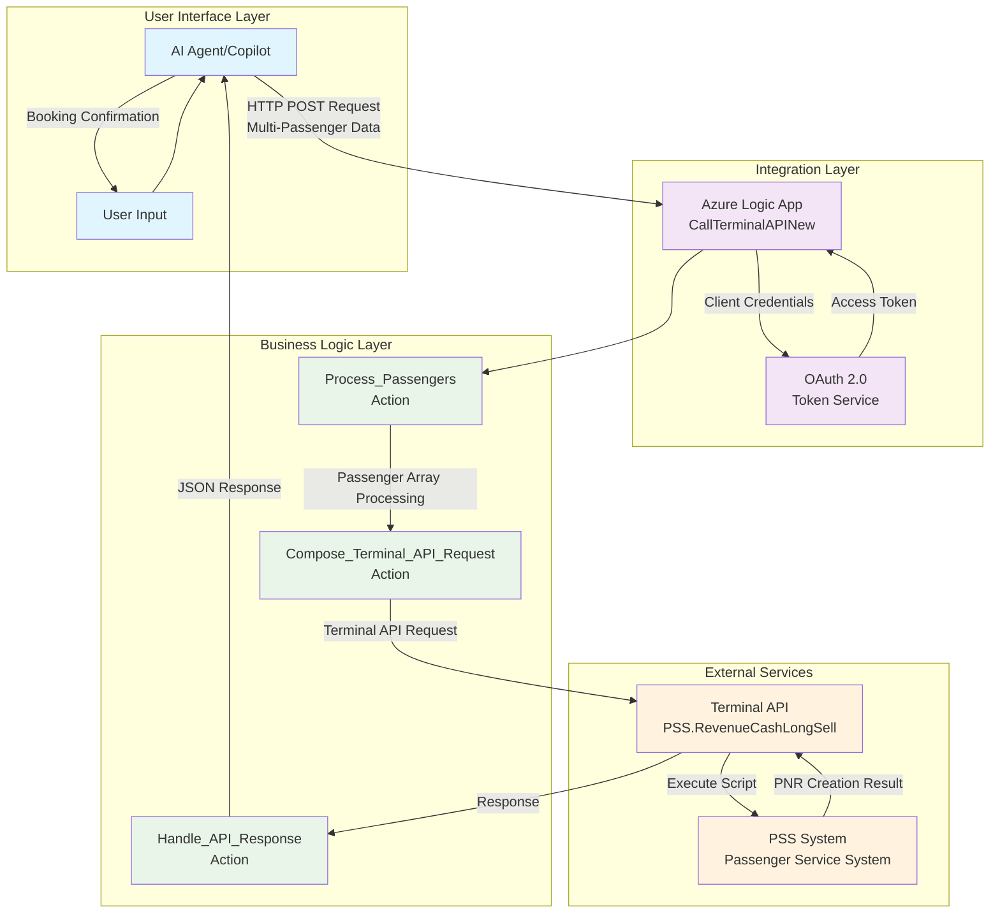

# 🎨 PowerPoint with Rendered Diagrams - Creation Guide

## 📊 **Method 1: Using Mermaid Live Editor (Recommended)**

### **Step 1: Render Diagrams Online**
1. Go to https://mermaid.live/
2. Copy each Mermaid diagram from `ARCHITECTURE_DIAGRAMS.md`
3. Paste into Mermaid Live Editor
4. Download as PNG/SVG (high quality)

### **Step 2: Diagram Locations in ARCHITECTURE_DIAGRAMS.md**

#### **Diagram 1: High-Level Design (HLD)**
```
Lines 5-45 in ARCHITECTURE_DIAGRAMS.md
- Shows 4-layer architecture
- Color-coded components
- Data flow arrows
```

#### **Diagram 2: Sequence Diagram**
```
Lines 50-120 in ARCHITECTURE_DIAGRAMS.md
- Complete user-to-PSS flow
- Authentication steps
- Multi-passenger processing
```

#### **Diagram 3: Logic App Action Breakdown**
```
Lines 125-190 in ARCHITECTURE_DIAGRAMS.md
- Detailed action flow
- Decision points
- Processing steps
```

#### **Diagram 4: Data Transformation Flow**
```
Lines 195-220 in ARCHITECTURE_DIAGRAMS.md
- Input → Output transformation
- JSON structure examples
```

#### **Diagram 5: Expression Logic Details**
```
Lines 230-265 in ARCHITECTURE_DIAGRAMS.md
- Dynamic passenger logic
- Expression evaluation
- Runtime processing
```

---

## 📝 **Method 2: Using VS Code + Mermaid Extension**

### **Step 1: Install Mermaid Extension**
1. Open VS Code
2. Install "Mermaid Markdown Syntax Highlighting" extension
3. Install "Markdown Preview Mermaid Support" extension

### **Step 2: Preview and Export**
1. Open `ARCHITECTURE_DIAGRAMS.md` in VS Code
2. Use `Ctrl+Shift+V` to preview markdown
3. Right-click on diagrams → "Copy as Image"
4. Paste directly into PowerPoint

---

## 🎯 **Method 3: Using Mermaid CLI (Advanced)**

### **Step 1: Install Mermaid CLI**
```powershell
npm install -g @mermaid-js/mermaid-cli
```

### **Step 2: Extract Diagrams to Files**
Create individual `.mmd` files for each diagram:

#### **hld.mmd**


### **Step 3: Generate Images**
```powershell
mmdc -i hld.mmd -o hld.png -w 1920 -H 1080
mmdc -i sequence.mmd -o sequence.png -w 1920 -H 1080
mmdc -i lld.mmd -o lld.png -w 1920 -H 1080
```

---

## 🎨 **Enhanced PowerPoint Slide Layout**

### **Slide 4: High-Level Architecture (with Diagram)**
```
┌─────────────────────────────────────────┐
│               SLIDE TITLE               │
│        High-Level Architecture          │
├─────────────────────────────────────────┤
│                                         │
│     [HLD DIAGRAM - Large Center]        │
│                                         │
│ ┌─────────────┐  ┌─────────────────┐    │
│ │ KEY POINTS  │  │ TECHNICAL SPECS │    │
│ │ • 4 Layers  │  │ • Azure Logic   │    │
│ │ • OAuth 2.0 │  │ • REST API      │    │
│ │ • Dynamic   │  │ • JSON/HTTPS    │    │
│ └─────────────┘  └─────────────────┘    │
└─────────────────────────────────────────┘
```

### **Slide 6: Data Flow Sequence (with Diagram)**
```
┌─────────────────────────────────────────┐
│            Data Flow Sequence           │
├─────────────────────────────────────────┤
│                                         │
│    [SEQUENCE DIAGRAM - Full Width]      │
│                                         │
├─────────────────────────────────────────┤
│ PROCESSING STEPS:                       │
│ 1. Natural Language → AI Processing     │
│ 2. JSON Request → Logic App             │
│ 3. Dynamic Groups → Terminal API        │
│ 4. PSS Execution → PNR Creation         │
│ 5. Response → User Confirmation         │
└─────────────────────────────────────────┘
```

---

## 🎯 **Recommended PowerPoint Structure with Diagrams**

### **Section 1: Overview (Slides 1-3)**
- Title, Executive Summary, Business Problem
- *No diagrams needed*

### **Section 2: Architecture (Slides 4-8)**
- **Slide 4**: HLD Diagram + Architecture overview
- **Slide 5**: Technical Innovation (code snippets)
- **Slide 6**: Sequence Diagram + Data flow
- **Slide 7**: LLD Diagram + Technical deep dive
- **Slide 8**: Terminal API (JSON examples)

### **Section 3: Implementation (Slides 9-14)**
- **Slide 9**: AI Agent Integration (schema examples)
- **Slide 10**: Security & Error Handling
- **Slide 11**: Testing with Expression Logic Diagram
- **Slide 12**: Implementation Timeline
- **Slide 13**: Benefits & ROI
- **Slide 14**: Technical Specifications

### **Section 4: Demo & Future (Slides 15-18)**
- Demo scenarios, Future roadmap, Conclusion, Q&A

---

## 💡 **Design Tips for Professional Look**

### **Color Scheme**
- **User Layer**: Light Blue (#e1f5fe)
- **Integration Layer**: Light Purple (#f3e5f5)
- **Business Layer**: Light Green (#e8f5e8)
- **External Layer**: Light Orange (#fff3e0)

### **Diagram Placement**
- **Full Slide**: Use for complex sequence diagrams
- **Half Slide**: HLD with bullet points alongside
- **Quarter Slide**: Small technical diagrams with explanations

### **Text Hierarchy**
- **Title**: 36pt Bold
- **Subtitle**: 24pt
- **Body**: 18pt
- **Diagram Labels**: 14pt

---

## 🚀 **Quick Start Instructions**

1. **Open** https://mermaid.live/
2. **Copy** first diagram from `ARCHITECTURE_DIAGRAMS.md`
3. **Paste** into Mermaid Live Editor
4. **Download** as PNG (1920x1080)
5. **Insert** into PowerPoint slide
6. **Repeat** for all 5 diagrams
7. **Format** slides with consistent layout

### **Files to Create:**
- `diagrams/hld.png` - High Level Design
- `diagrams/sequence.png` - Sequence Diagram  
- `diagrams/lld.png` - Logic App Actions
- `diagrams/data-flow.png` - Data Transformation
- `diagrams/expressions.png` - Expression Logic

**Result**: Professional PowerPoint with beautiful, rendered Mermaid diagrams! 🎨✨