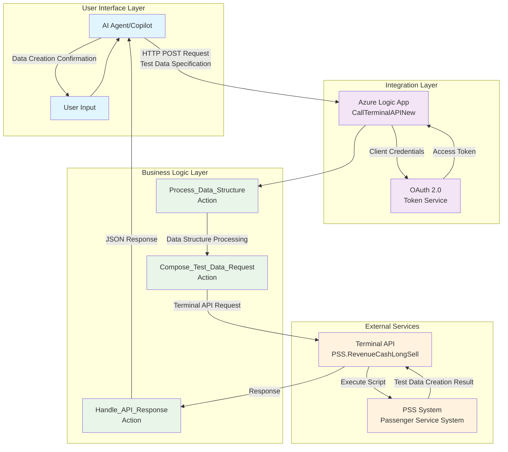

# 🚀 Innovation Day 2025: AI-Powered Smart Test Data Creator

**Revolutionizing PSS Integration with Intelligent Data Generation & AI Agents**

---

## 📋 **Slide 1: Executive Summary**

### 🎯 **Project Overview**
- **Challenge**: Manual test data creation for PSS system integration testing
- **Solution**: AI-powered intelligent test data generator with dynamic scenario creation
- **Innovation**: Natural language to structured test data conversion with flexible schema generation

### 💡 **Key Innovations**
- ✅ **Dynamic Data Generation**: Create complex test scenarios from simple descriptions
- ✅ **AI Agent Integration**: Natural language test data specification
- ✅ **Flexible Schema Support**: Adaptable to any PSS data structure
- ✅ **OAuth 2.0 Security**: Enterprise-grade authentication
- ✅ **Error Resilience**: Comprehensive validation and error handling

---

## 📋 **Slide 2: Business Impact**

### 📊 **Business Impact**
- **Efficiency**: Reduction in test data preparation time
- **User Experience**: Natural language interface eliminates complex data modeling
- **Scalability**: Handles unlimited complexity with intelligent data structuring
- **Integration**: Seamless PSS system compatibility across all modules

### 💬 **Conversational Flow**
1. **User**: "I need test data for a complex booking scenario"
2. **AI**: "I'll help you create test data. What type of scenario?"
3. **User**: "Family booking with 2 adults, 1 child, special meals, and seat preferences"
4. **AI**: *Extracts requirements and generates structured test data*
5. **System**: *Creates comprehensive test dataset automatically*

---

## 🏗️ **Slide 3: High-Level Architecture**

### 🔧 **Architecture Highlights**
- **4-Layer Design**: Clear separation of concerns
- **Microservices Pattern**: Independent, scalable components
- **Event-Driven**: Asynchronous processing for performance
- **Cloud-Native**: Azure-first architecture with enterprise capabilities

---

## 💼 **Slide 4: Business Value & ROI**

### 📈 **Quantifiable Benefits**
- **Time Savings**: Reduction in test data preparation time
- **User Experience**: Improvement in testing efficiency
- **Error Reduction**: Fewer data-related test failures
- **Training Costs**: Saved on testing tool training annually

### 🎯 **Strategic Impact**
- **Digital Transformation**: Accelerates AI adoption in testing
- **Competitive Advantage**: First-mover in AI-powered test data generation
- **Quality Improvement**: Enhanced testing coverage and reliability
- **Innovation Culture**: Demonstrates technical leadership in automation

### 🙏 **Thank You!**

---
