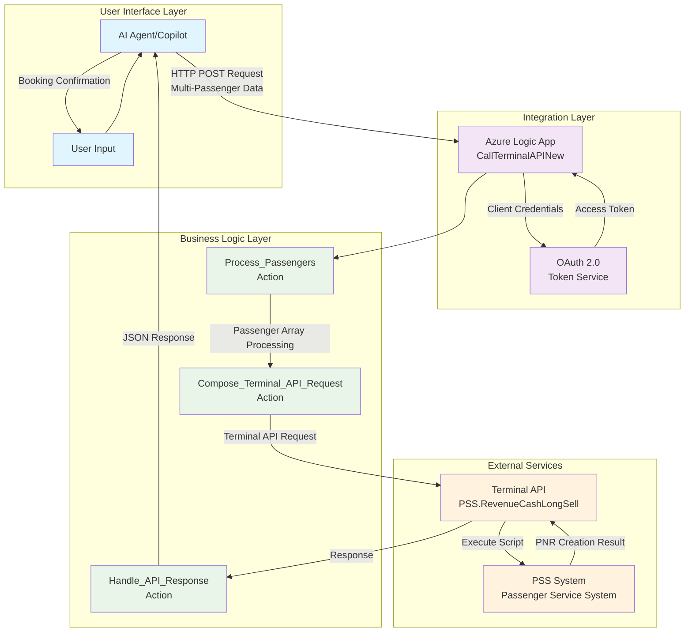
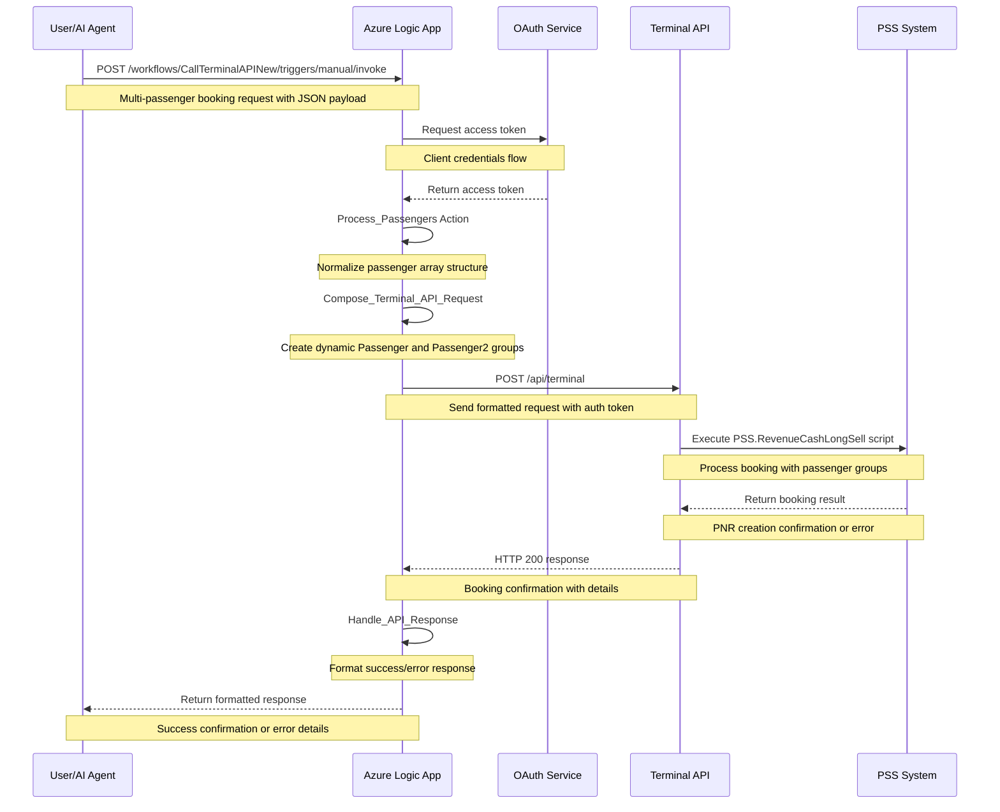
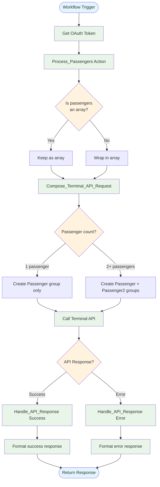
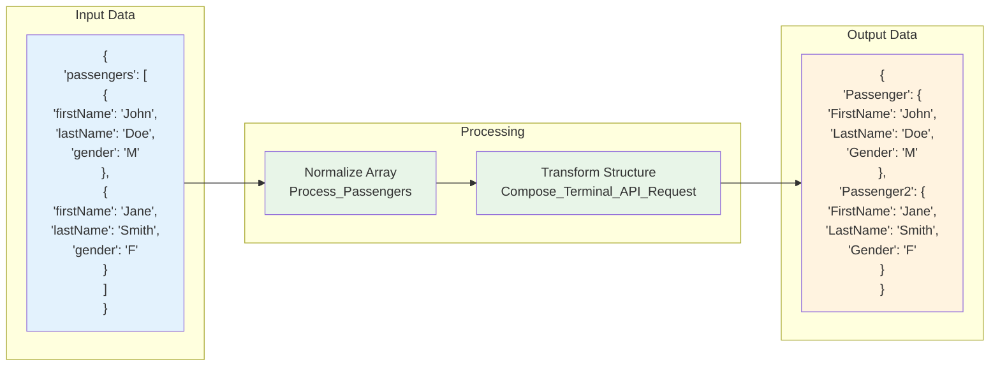
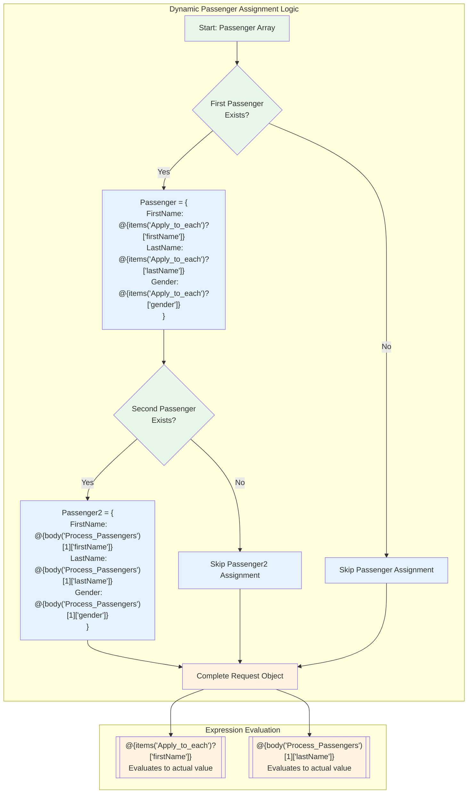

# 🏗️ Azure Logic App Multi-Passenger System - Mermaid Diagrams

## 📊 High-Level Design (HLD)

## 🔄 Sequence Diagram

## ⚙️ Logic App Action Flow (LLD)

## 📊 Data Transformation Flow

## 🔧 Expression Logic Details

---

## 📁 Individual Diagram Files

For CLI usage or separate rendering:
- `diagrams/hld.mmd` - High-Level Design
- `diagrams/sequence.mmd` - Sequence Diagram
- `diagrams/lld.mmd` - Logic App Action Flow
- `diagrams/data-flow.mmd` - Data Transformation
- `diagrams/expressions.mmd` - Expression Logic

## 🎯 GitHub Presentation Tips

1. **Direct Link**: Share the GitHub link to this file for live diagram viewing
2. **Full Screen**: Click diagrams to view in full screen on GitHub
3. **Mobile Friendly**: Diagrams render well on mobile devices
4. **Interactive**: GitHub allows zooming and panning of complex diagrams
5. **Always Updated**: Any changes pushed to Git automatically update the diagrams

**Perfect for Innovation Day presentations!** 🚀✨